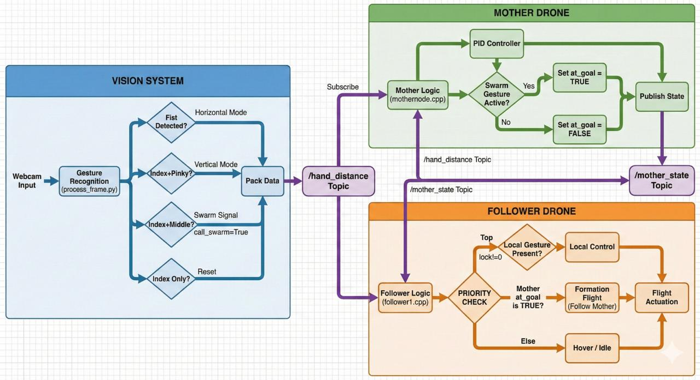

# Gesture Controlled Drone

**Gesture Controlled Drone** is a vision-based human gesture control system for quadrotors. It enables intuitive real-time human-drone interaction using natural body gestures, while a closed-loop yaw controller keeps the drone oriented toward the user.

<p align="center">
  
</p>

To run the project quickly, start with [Quick Start](#1-quick-start). For the perception, control, and validation details, see the sections below.

If this project helps you, please consider starring the repository.

## Table of Contents

- [1. Quick Start](#1-quick-start)
- [2. System Architecture](#2-system-architecture)
- [3. Validation and Testing](#3-validation-and-testing)
- [4. Use in Your Application](#4-use-in-your-application)

## 1. Quick Start

This project has been tested on **Ubuntu 22.04** with **ROS 2 Humble**.

Install the required system dependencies:

```bash
sudo apt-get update
sudo apt-get install -y \
  cmake \
  build-essential \
  git \
  wget \
  python3-pip \
  python3-setuptools \
  python3-numpy \
  python3-opencv \
  ros-humble-camera-ros \
  ros-humble-sensor-msgs \
  ros-humble-std-msgs \
  ros-humble-geometry-msgs \
  ros-humble-mavros-extras
```

Install the Python vision/perception dependency:

```bash
pip3 install mediapipe==0.10.9
```

The image-processing pipeline uses **OpenCV** through `cv2` and manually converts ROS image messages with NumPy, so `cv_bridge` is not required.

<pre>
raw_data = np.frombuffer(msg.data, dtype=np.uint8)
yuv = raw_data.reshape((msg.height + msg.height // 2, msg.step))
yuv = yuv[:, :msg.width]
frame = cv2.cvtColor(yuv, cv2.COLOR_YUV2BGR_NV21)
</pre>

Install MAVROS GeographicLib datasets:

```bash
wget https://raw.githubusercontent.com/mavlink/mavros/ros2/mavros/scripts/install_geographiclib_datasets.sh
chmod +x install_geographiclib_datasets.sh
sudo ./install_geographiclib_datasets.sh
rm install_geographiclib_datasets.sh
```

Clone and build the workspace:

```bash
git clone git@github.com:RishabhChandrakar/gesture-controlled-drone.git
cd gesture-controlled-drone
colcon build
source install/setup.bash
```

Run the gesture-control pipeline from separate terminals as required by your setup.

Start one of the object tracker nodes:

```bash
source install/setup.bash
ros2 run object_tracker tracker_rpi
```

Start the human tracking controller:

```bash
source install/setup.bash
ros2 run human_tracking_controls mavros_yaw_body_tracking
```

Other tracker entry points, such as `tracker_soumya` and `tracker_rishabh`, are also available for setup-specific experiments.

## 2. System Architecture

The system combines four major components:

- **Human pose estimation** for extracting body landmarks from camera input.
- **Gesture interpretation** using geometric and joint-angle relationships.
- **State-machine-based interaction logic** for stable gesture transitions.
- **Closed-loop yaw control** for keeping the drone aligned with the user.

The complete ROS 2 architecture is organized around two primary packages.

### Object Tracker Package

The **Object Tracker** package handles the vision pipeline and gesture recognition.

**`process_frame`**

Extracts key human body landmarks from monocular camera input using **MediaPipe** and recognizes gestures using geometric and joint-angle relationships.

**`tracker_node`**

Connects perception output with state-machine-based interaction logic for stable gesture recognition, safe transitions, and robust interaction.

**Primary outputs**

- `/lateral_command`: lateral motion command with direction and intensity.
- `/waist_angle`: human position offset used by the yaw controller.

### Human Tracking Controls Package

The **Human Tracking Controls** package manages the flight-control side of the system.

**Closed-loop tracking and control**

Uses a **PID-based yaw controller** driven by the human position offset, allowing the drone to continuously face the user.

**Lateral motion control**

Converts body-frame commands into world-frame motion for left and right drone movement.

**Position hold**

Activates automatically when no valid gesture is detected, helping the drone maintain a stable hover.

### Safety Mechanisms

The control pipeline includes safety handling for perception loss and ambiguous gesture input:

- Vision-timeout fallback to hover.
- Threshold-based engagement and disengagement of tracking.
- Stable control transitions using finite-state logic.

## 3. Validation and Testing

The complete pipeline has been validated in both simulation and real hardware experiments.

### Simulation Environment

Simulation testing was performed using:

- **Gazebo**
- **ROS 2**
- **ArduPilot SITL**

<p align="center">
  
</p>

<p align="center">
  
</p>

### Real Hardware Platform

Hardware testing was performed on:

- **F450 quadrotor**
- **Raspberry Pi 4**
- **Raspberry Pi Camera**

<p align="center">
  
</p>

<p align="center">
  
</p>

## 4. Use in Your Application

This project can be adapted for other human-drone interaction workflows by reusing the perception and control packages independently:

- Use `object_tracker` when you need gesture recognition from monocular camera input.
- Use `human_tracking_controls` when you need yaw alignment, lateral gesture motion, and hover fallback behavior.
- Tune gesture thresholds, PID gains, and timeout values according to your drone frame, camera placement, and operating environment.
